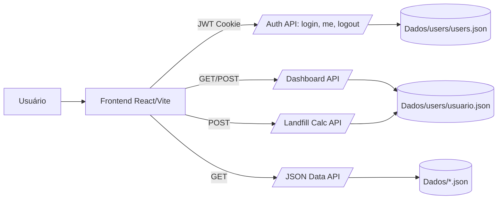

<<<<<<< HEAD
# GasElet
=======
# Gaselet

[](#)
[](#stack)
[](#stack)
[](./.github/workflows/ci.yml)
[](./LICENSE)

Plataforma full stack para planejamento de aterros, projeção populacional, cálculo de RSU/metano e estimativa de geração elétrica por cenário.

## Sumário

- [Visão de Produto](#visão-de-produto)
- [Diferenciais Técnicos](#diferenciais-técnicos)
- [Arquitetura](#arquitetura)
- [Stack](#stack)
- [Demonstração Local](#demonstração-local)
- [Documentação Técnica](#documentação-técnica)
- [Resumo para Portfólio e LinkedIn](#resumo-para-portfólio-e-linkedin)
- [Roadmap](#roadmap)
- [Licença](#licença)

## Visão de Produto

O Gaselet foi construído para transformar dados de municípios e parâmetros operacionais de aterro em decisões técnicas:

- cadastro de cidades por cenário e acompanhamento anual;
- cálculo de RSU com base em população e coeficientes regionais;
- modelagem de metano até horizonte futuro (ex.: 2060);
- comparação de geradores e estimativa de residências atendidas;
- visualização geográfica por município (mapa + malhas IBGE);
- persistência por usuário (servidor + fallback local).

## Diferenciais Técnicos

- Backend em C++ (Drogon) com processamento numérico e API autenticada.
- Segurança de autenticação com JWT (cookie HttpOnly e suporte a Bearer).
- Restrição de cadastro de usuários à máquina local do servidor.
- Persistência por cenário com autosave e recuperação por cache local.
- Frontend React com dashboards interativos e responsivos.

## Arquitetura



Documentação detalhada da arquitetura: [docs/ARCHITECTURE.md](./docs/ARCHITECTURE.md)

## Stack

### Frontend

- React 19
- Vite 7
- React Router
- Recharts + Nivo
- Leaflet + React Leaflet

### Backend

- C++17
- Drogon
- jwt-cpp
- OpenSSL
- libxcrypt (bcrypt)
- CMake

## Demonstração Local

### Pré-requisitos

- Node.js 20+
- npm 10+
- CMake 3.14+
- Compilador C++ com suporte C++17
- Dependências do Drogon/OpenSSL/libxcrypt instaladas

### 1) Frontend (dev)

```bash
cd client
npm install
npm run dev
```

### 2) Backend

```bash
cd server
cmake -S . -B build -DCMAKE_BUILD_TYPE=Release
cmake --build build -j
JWT_SECRET="troque-este-segredo" ./build/drogon-react-ws
```

### 3) Build de produção do frontend

```bash
cd client
npm run build
```

## Documentação Técnica

- API: [docs/API.md](./docs/API.md)
- Deploy: [docs/DEPLOY.md](./docs/DEPLOY.md)
- Arquitetura e fluxo de dados: [docs/ARCHITECTURE.md](./docs/ARCHITECTURE.md)
- CI pipeline: [.github/workflows/ci.yml](./.github/workflows/ci.yml)
- Segurança e política: [SECURITY.md](./SECURITY.md)
- Contribuição: [CONTRIBUTING.md](./CONTRIBUTING.md)
- Histórico de mudanças: [CHANGELOG.md](./CHANGELOG.md)


## Roadmap

- suíte de testes automatizados (frontend e backend);
- observabilidade (logs estruturados + métricas);
- pipeline CI/CD (lint, build, testes e release);
- internacionalização da interface e documentação bilíngue.

## Licença

Este projeto está sob licença MIT. Veja [LICENSE](./LICENSE).
>>>>>>> f42503e (init)
